# CNPG Backup Plugin Testing

Evaluation of three CloudNativePG (CNPG) backup plugins across functional correctness, compatibility, and throughput.

Research, testing, scripting and summary documentation were done by **AI tools**, supervised and reviewed by Jeremy Schneider.

AI tools can generate a lot of text that needs reading and reviewing. I went through the majority of the content here, but a few inaccuracies could have slipped through. Treat it the same as you would other AI tool outputs. It's what I was able to get done over the course of a few days - but there's a lot more that could still be done!

I tried to include all the code that was used to run the tests and generate the charts. Feel free to feed everything here into your own AI tools for digesting it or building on it.

---

## Documents

| File | Description |
|---|---|
| [comparison.md](comparison.md) | Side-by-side plugin comparison/research: history, maintainers, testing & bug fixes, feature coverage |
| [test-results.md](test-results.md) | Full test log: T1–T12 functional and performance tests, setup steps, commands, and results |
| [benchmark-learnings.md](benchmark-learnings.md) | T9/T12 performance tests details - architecture notes, plugin-specific findings, and gotchas discovered during testing |
| [t9-environment-info.md](t9-environment-info.md) | Hardware and software environment for T9 throughput benchmark (AWS EKS) |
| [t12-environment-info.md](t12-environment-info.md) | Hardware and software environment for T12 WAL throughput benchmark (AWS EKS) |

---

## Scripts

| File | Description |
|---|---|
| [aws-setup.sh](aws-setup.sh) | Provision EKS cluster with local NVMe for throughput benchmarks |
| [aws-teardown.sh](aws-teardown.sh) | Tear down EKS cluster and associated resources |
| [t9-benchmark-aws.sh](t9-benchmark-aws.sh) | Automated backup/restore throughput benchmark (T9) |
| [t12-wal-benchmark-aws.sh](t12-wal-benchmark-aws.sh) | Automated WAL archiving throughput benchmark (T12) |

---

## T9 — Backup & Restore Throughput Charts

<table>
<tr>
<td><a href="t9-backup-rate.png">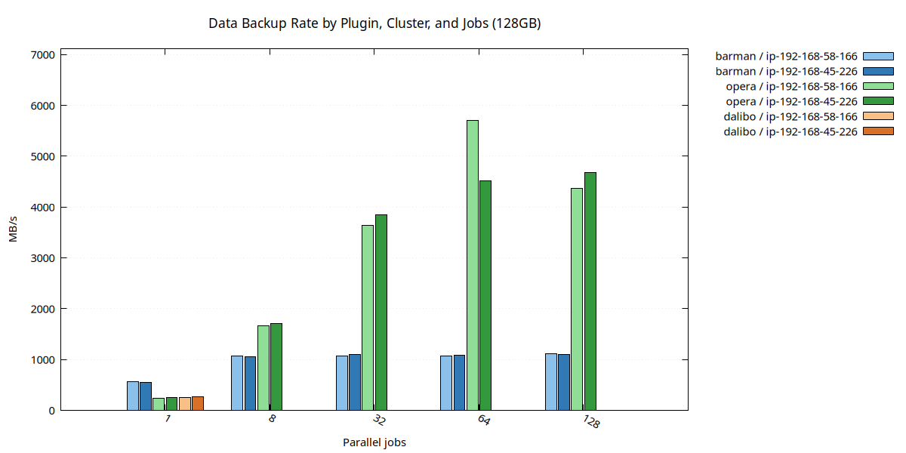</a> <em>Backup throughput by plugin and parallelism</em></td>
<td><a href="t9-restore-rate.png">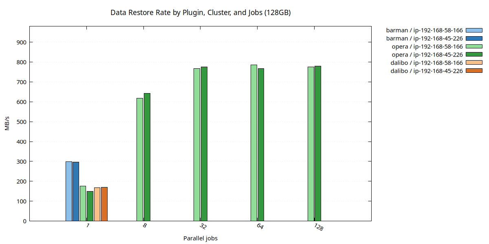</a> <em>Restore throughput by plugin and parallelism</em></td>
</tr>
<tr>
<td><a href="backup-j32-utilization.png">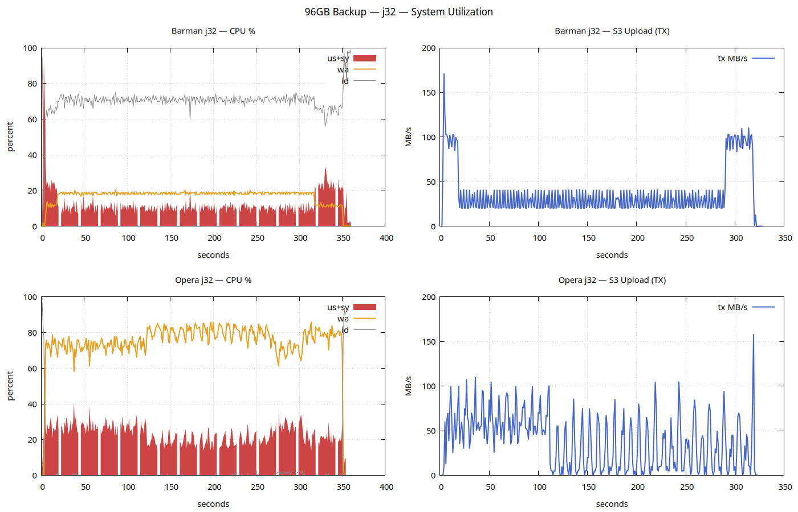</a> <em>CPU/network utilization during j=32 backup</em></td>
<td><a href="restore-opera-rx-timeseries.png">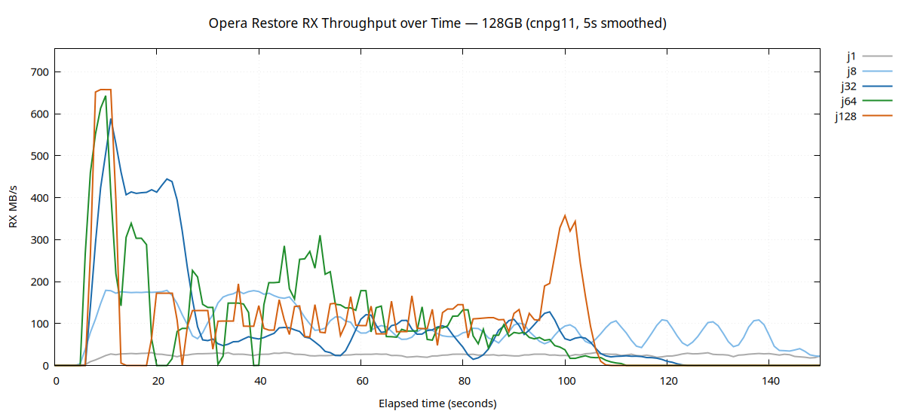</a> <em>Opera restore network RX timeseries</em></td>
</tr>
</table>

### T9 Detail Charts

<table>
<tr>
<td><a href="cnpg11-backup-barman-j64-detail.png">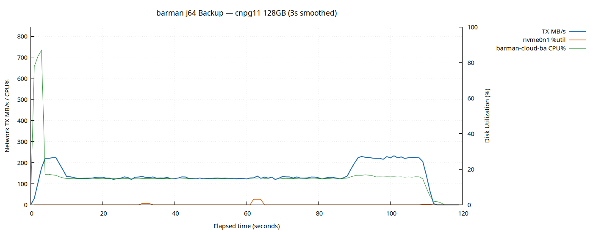</a> <em>cnpg11 · Barman backup · j=64</em></td>
<td><a href="cnpg11-backup-opera-j64-detail.png">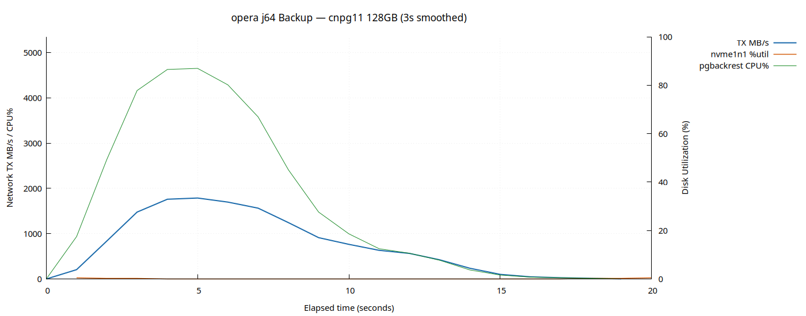</a> <em>cnpg11 · Opera backup · j=64</em></td>
<td><a href="cnpg11-restore-barman-j1-detail.png">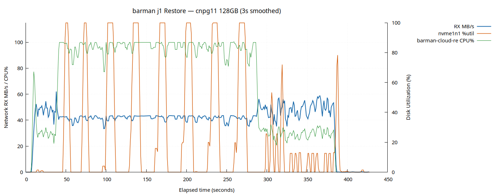</a> <em>cnpg11 · Barman restore · j=1</em></td>
<td><a href="cnpg11-restore-opera-j64-detail.png">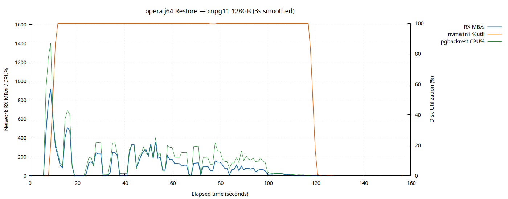</a> <em>cnpg11 · Opera restore · j=64</em></td>
</tr>
<tr>
<td><a href="cnpg12-backup-barman-j64-detail.png">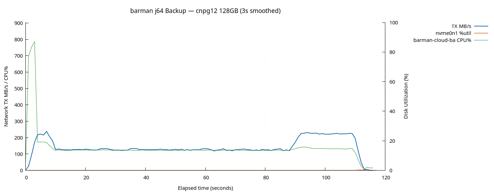</a> <em>cnpg12 · Barman backup · j=64</em></td>
<td><a href="cnpg12-backup-opera-j64-detail.png">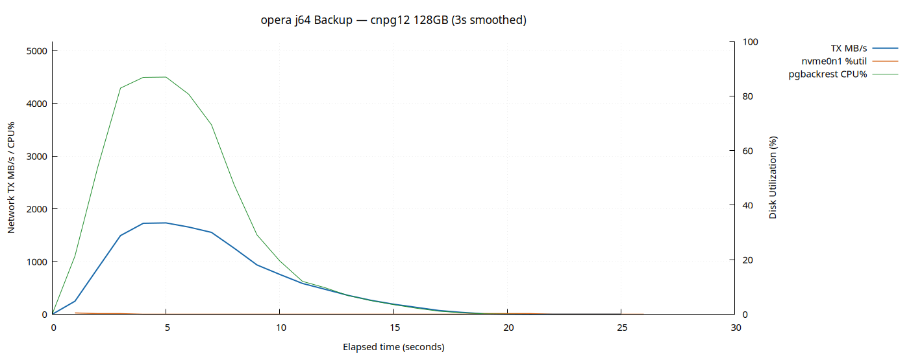</a> <em>cnpg12 · Opera backup · j=64</em></td>
<td><a href="cnpg12-restore-barman-j1-detail.png">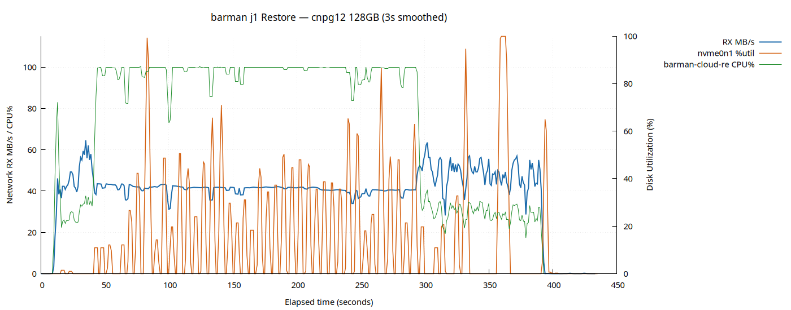</a> <em>cnpg12 · Barman restore · j=1</em></td>
<td><a href="cnpg12-restore-opera-j64-detail.png">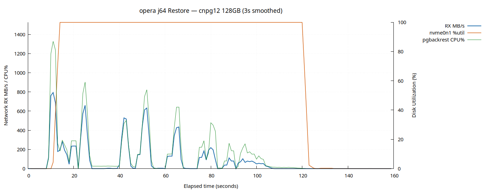</a> <em>cnpg12 · Opera restore · j=64</em></td>
</tr>
</table>

---

## T12 — WAL Archiving Throughput Charts

<table>
<tr>
<td><a href="wal-archive-during.png">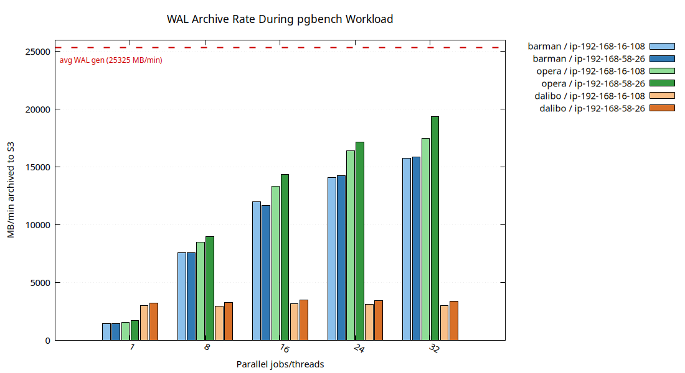</a> <em>WAL archive rate during benchmark</em></td>
<td><a href="wal-archive-drain.png">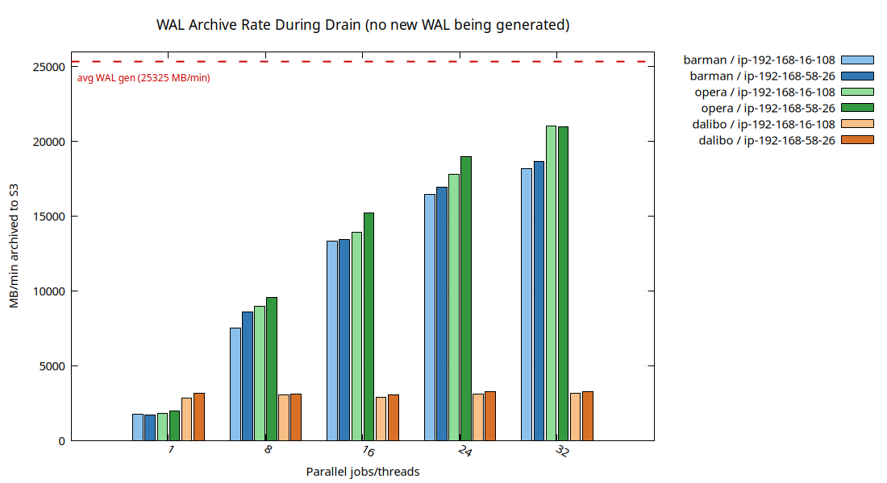</a> <em>WAL archive drain after benchmark</em></td>
</tr>
<tr>
<td><a href="wal-restore-rate.png">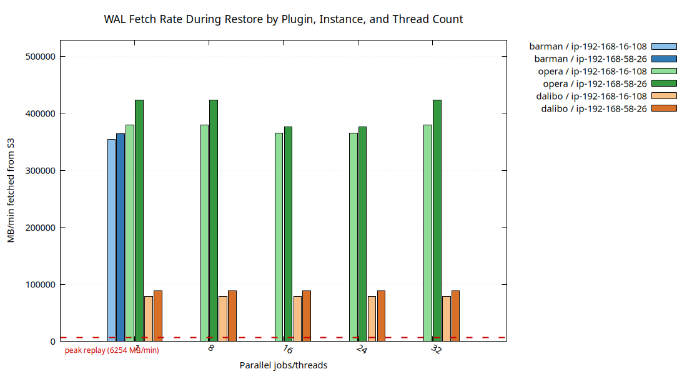</a> <em>WAL restore rate</em></td>
<td><a href="net-32threads.png">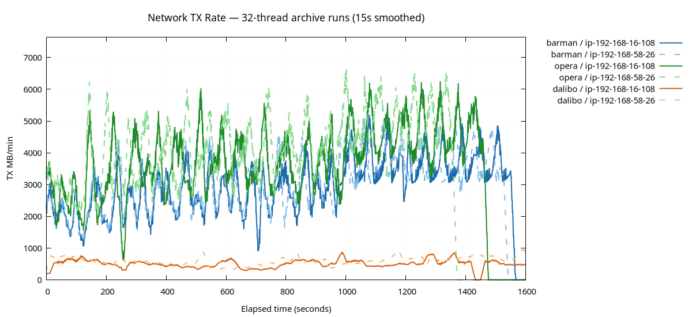</a> <em>Network utilization at 32 WAL threads</em></td>
</tr>
</table>

---

## License

Licensed under the Apache License, Version 2.0. See [LICENSE](LICENSE) for the full text and [NOTICE](NOTICE) for the copyright notice.
